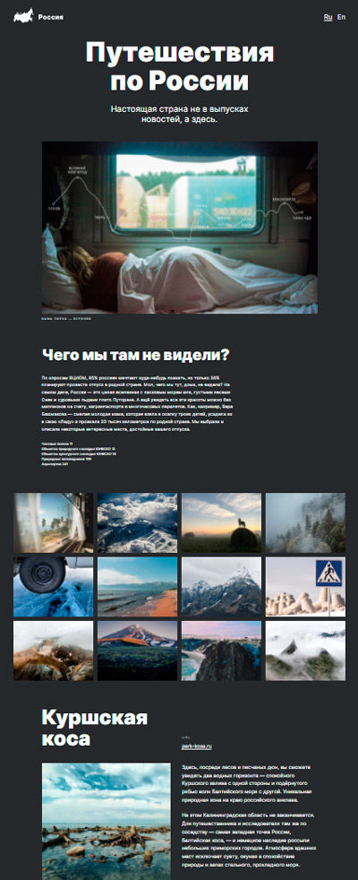

# Проект: Путешествия по России

***
###При написании проекта использовались технологии:
HTML, 
CSS, 
Flex-box, 
Flex-grig.

***

Web-ссылка к проекту:

Зеркало проекта: https://3rt.ulam.ru/

***

###Проект включает в себя иллюстрации и текстовые описания:

[Куршская коса] http://park-kosa.ru

[Кольский] https://yourshot.nationalgeographic.com/photos/?keywords=kolskiy

[Алтай] https://www.facebook.com/vera.bashmakova/posts/10156011613718822

[Зимний Байкал] https://vk.com/baikalmile

[Карелия] http://vodlozero.ru

[До Байкала на собаках] https://stampsy.com/na-elektrichkakh-do-baikala

***

###В проекте использутся ссылки на интерактивные сервисы:

[ Карты ] https://yandex.ru/maps
[ Погода ]https://yandex.ru/pogoda
[ Расписание ] https://rasp.yandex.ru
[ Календарь ]https://calendar.yandex.ru
[ Путешествия ]https://travel.yandex.ru

***

##Информация о платформе и разработчике
Платформа: [Яндекс-Практикум](https://practicum.yandex.ru/)

Разработчик:[Уланов Михаил](mailto:imaginator@yandex.ru)
